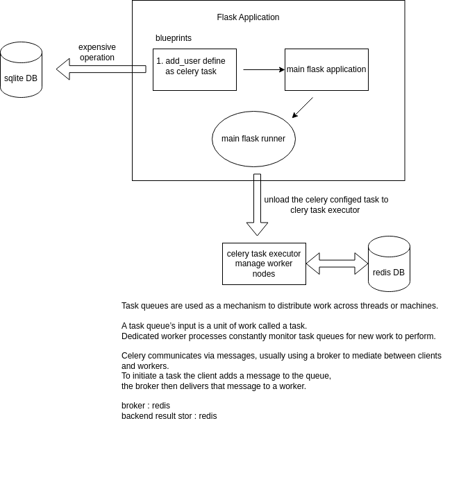

# Flask-Celery-Async-Tasks
repo describes how to integrate flask with celery and redis to achieve asynchronous background task execution

# Solution Diagram

# Solution Steps

### Task 1. define flask app with blueprints 
ToDO.

### Task 2. create sqlite3 db and connect with flask
ToDO.

### Task 3. modify the code base into celery compatible way
ToDO.

### Task 4. install redis and init redis server
ToDO.

### Task 5. initiate celery worker process with worker nodes
ToDO.